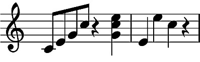

# C Flat
C Flat (stylized as C♭) is an esoteric programming language that uses music for its syntax.
## Concept
C♭ was created with two main ideas in mind:
1. Allow enough creative freedom for good songs to be made
1. Rely more on the sound of music than the notation

The first idea is there because there isn't much point in making programs out of music if the music doesn't sound good. (Technically there isn't much point either way.)

The second one is there to keep the concept grounded in music as code rather than musical notation as code. Quarter notes and eigth notes doing different things sounds good on paper, but if you're listening to a performance, there's no guarantee you'll be able to tell which notes are quarter notes.

## Notation
While the C♭ interpreter currently only takes MIDI files as input, C♭ programs can be notated in many ways (including standard musical notations) as long as they maintain the details necessary to interpret the program. Even a live performance can be considered proper notation if the performer is clear and accurate enough. The most basic text-based notation uses note numbers in parentheses to represent the sequence of notes, chords, and rests. 

>Cat program in staff notation and text notation

    ( 60 )( 64 )( 67 )( 72 )( -1 )( 67 72 76 )( 64 )( 76 )( 72 )( -1 )

Multiple numbers in the same set of parentheses (separated by spaces) represent chords, and rests are represented by ( -1 ). When the C♭ interpreter is used in debug mode on a program, it prints out the whole program in this format, with 10 sets of parentheses on each line. 

## Examples
>"Nobody's actually gonna want to code with this, just show them the example programs."

The MIDI files and sheet music for example programs can be found in the [examples folder](examples).

The following is the text notation for the Hello World program located there.

    ( 63 59 )( 66 )( 63 )( 59 )( -1 )( 68 )( 66 71 )( 66 )( -1 )( 68 60 56 )
    ( 66 )( 68 )( 59 )( -1 )( 63 56 )( 59 )( 66 )( 63 )( -1 )( 68 )
    ( 71 75 )( 66 71 59 )( 61 )( -1 )( 63 54 )( 59 )( 68 )( 66 )( -1 )( 66 71 63 57 )
    ( 64 68 )( 63 66 )( 59 )( 66 )( 63 )( -1 )( 63 66 71 )( 61 )( -1 )( 63 66 75 )
    ( 59 )( 71 )( 66 )( -1 )( 59 63 )( 56 )( 59 )( 61 )( -1 )( 61 )
    ( 63 75 )( 66 71 )( 59 63 )( -1 )( 59 54 51 )( 56 )( 62 )( 61 )( -1 )( 59 54 51 )
    ( 56 )( 62 )( 61 )( -1 )( 59 63 )( 61 )( 59 )( 56 )( -1 )( 54 51 )
    ( 59 63 )( 56 61 )( 56 )( 63 )( 61 )( -1 )( 59 )( 63 )( -1 )( 61 59 66 )
    ( 61 )( 59 )( 56 )( -1 )( 54 49 )( 56 )( 61 )( 59 )( -1 )( 61 )
    ( 63 71 )( 59 )( -1 )( 59 54 51 )( 56 )( 59 )( 59 )( -1 )( 59 54 )( 61 )
    ( 59 )( 66 )( -1 )( 68 )( 68 71 )( 59 )( -1 )( 59 54 51 )( 61 )( 63 )
    ( 66 )( -1 )( 59 54 51 )( 61 )( 63 )( 56 )( -1 )( 61 56 )( 61 )( 66 )
    ( 63 )( -1 )( 63 59 )( 66 70 )( 66 71 )( 61 )( 59 )( 56 )( -1 )( 66 )
    ( 63 )( -1 )( 61 56 54 )( 61 )( 59 )( 63 )( -1 )( 66 61 59 )( 56 )( 59 )
    ( 61 )( -1 )( 59 54 51 )( 59 )( 66 )( 63 )( -1 )( 68 71 )( 73 )( 75 )
    ( 75 59 )( -1 )( 71 )( 71 )( 59 )( -1 )( 71 63 59 )( 73 )( 71 )( 63 66 71 47 )

## Running a C♭ Program
The C♭ interpreter is written in C using only standard libraries, and thus can be compiled very easily with pretty much any C compiler.
    
    $ gcc cflat.c -o cflat

Once you have compiled the interpreter, running a program works like this:

    $ ./cflat filename flags

There are 2 flags that the interpreter can be run with. `-d` for debug and `-m#` to fix a common problem.

Because the MIDI parser in the interpreter is something I wrote with incomplete knowledge of the format, small pauses between notes can sometimes be counted as rests. To fix this, running with `-m#` ignores all 'rests' of `#` length or shorter. The debug mode will print out the shortest pause so you can know what number to use if you have too many rests.

Currently, the Hello World example program has this problem, and therefore must be run like this:

    $ ./cflat examples/HelloWorld.mid -m100

## Syntax
Alright, enough with the conceptuals. How does C♭ work?

I wrote the syntax in Backus-Naur Form [here](res/BNF.md) for the people who know how to read it. There's still some things that it doesn't explain, though, so you'll still need to read the rest of this section to be able to write a C♭ program.

### Statements
A C♭ program is a series of statements. A statement is anything that can stand on its own. This includes input, output, assignment, and jumps. Statements are defined by the note/chord at the beginning of where a statement should be. 
#### Input
Input statements start with any singular note or two notes that form an octave (because that's kind of like one note.) This is followed by the location that the data will be stored to as described below. Input statements only accept numeric values, and function like `scanf("%d")` in C.

    <Note><Location>

#### Assign
Assignment statements begin with a chord of any two notes that aren't an octave (see above). This is followed by the location that the data will be stored to and the value that is to be stored there.

    <2 Notes><Location><Value>

#### Output / Print
If you're starting to see the pattern, you'll know that Output and Print statements begin with a 3 note chord. If the interval between the lower two notes is smaller than the interval between the higher two notes, it will print out the ASCII character of the data at the location supplied. Otherwise, it will print out the number itself. Much like the Input statement, this statement is followed by the location of the data being used. 

    <3 Notes><Location>

#### Labels (Conditional Jumps)
4 note statements are Labels. This is the only statement where the individual notes matter, because those notes define the label itself. The next chord defines whether the label is setting the location to jump to or saying to jump to that location if a condition is met.
Amount of Notes | Type
------------ | -------------
1 | Jump if Equal
2 | Jump if Greater / Less
3 | Jump if Not Equal
4+ or Rest | Set Label

Greater than and less than are distinguished by the interval of the two notes. If the interval is an even number of semitones (black and white keys), then its greater than, and odd is less than.

    <4 Notes><Rest or 4+ Notes>              //Set Label
    <4 Notes><1-3 Notes><Value><Value>       //Conditional Jump

### Location
The way variables are stored in C♭ can be thought of as every note on the keyboard having an infinite array of numbers. Therefore, locations start with a single note which defines which array to use. This is followed by a value that represents which item of that array to access.

    <Note><Value>

### Value
The first chord when defining a value tells whether it is a literal or an operation. These are both a little complicated, so let's split them up.

#### Literals
If the number of notes in the first chord is odd, then the value is a literal. This means it is just a straight-up number with no funny business. The rest of the notes in the sequence define what number it is. 

This is the only part where what the exact note is makes a difference. Every key on the keyboard is given a value, with Middle C being 0 and higher notes being higher and lower notes being lower. Another way of calculating a notes value is to take its MIDI value and subtract 60.

A chord of notes multiplies note values together, and all of the chords in a sequence are added together to get the final value. Since there can be any number of chords in this sequence, it must be ended with a rest.

    <Chord of Odd Notes><Any amount of Chords><Rest> 

#### Operations
If the number of notes in the first chord is even, the value is an operation. There are five types of operations in C♭: 4 math functions and getting the value of a variable. The second chord of the value defines the type of the operation. Math operations are all 2 notes, so to get the value of the variable you can just use the location, because it starts with one note. The math operations are distinguished by the number of semitones (black and white keys) between the two notes. (two adjacent notes is an interval of 1)

Operation | Intervals
------------ | -------------
Addition | 4, 6, 11
Subtraction | 2, 5, 8
Multiplication | 1, 7, 10
Division | 3, 9

Math operations are followed by the two values that are being operated on.

    <Chord of Even Notes><2 Notes><Value><Value>
    <Chord of Even Notes><Location>
